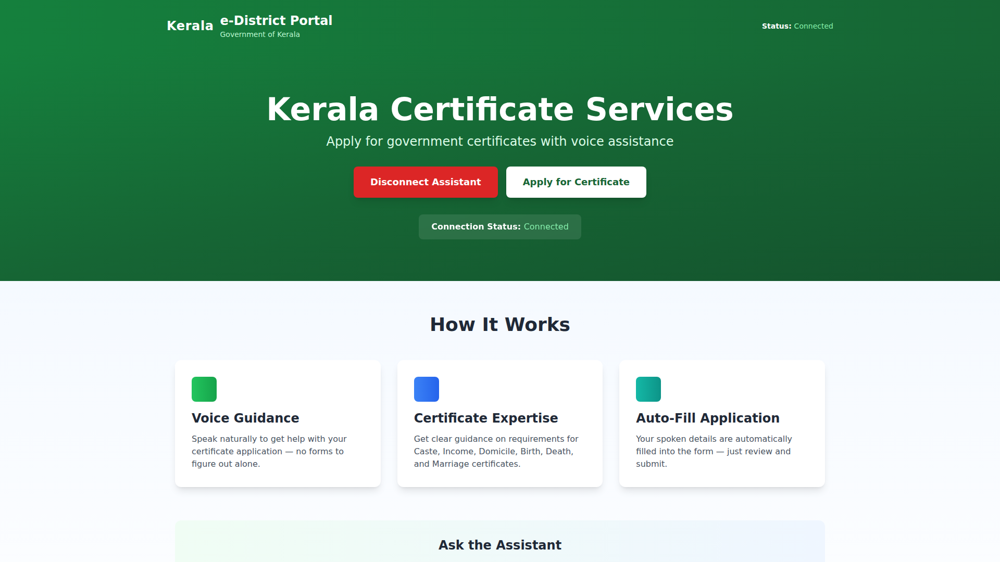
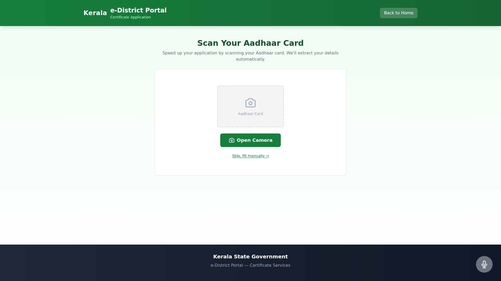

# Kerala e-District Portal - Demo Presentation

## Multi-Agent System for Government Certificate Applications

---

### Slide 1: Kerala e-District Portal

**AI-Powered Certificate Application**

- Voice-enabled form filling
- Aadhaar card scanning
- Multi-agent collaboration

---

### Slide 2: Step 1: Scan Aadhaar Card

**Auto-extract all details with AI**

- Camera access for mobile users
- GPT-4 Vision OCR

---

### Slide 3: Step 2: Voice-Powered Form

**Speak naturally to fill the form**

- Real-time speech recognition
- Smart field extraction

---

## Key Features

- 🎤 **Voice-First Interface** - Speak to fill forms
- 📸 **AI Document Scanning** - Extract data from Aadhaar cards
- 🤖 **Multi-Agent Architecture** - Specialized agents for each task
- ⚡ **Real-Time Processing** - WebRTC for instant feedback
- 📱 **Mobile-Optimized** - Camera & voice work seamlessly

## Technical Stack

- Next.js 15 + React 19 + TypeScript
- OpenAI Realtime API (voice) + GPT-4o Vision (OCR)
- WebRTC data channels
- Production deployment with SSL

## Impact

**80% time reduction** - From 10 minutes to 2 minutes per application

---

**Live Demo:** https://hackathon.lethimbuild.com  
**GitHub:** https://github.com/jamaljm/build-for-india

Built for **Build for India Hackathon 2026** - Multi-Agent Systems Track
